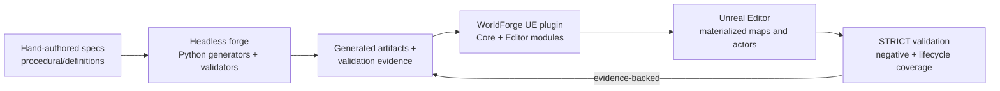

# WorldForge

<div align="center">

### The factory for adaptive Unreal worlds — not the game itself.

[](https://github.com/markwuenschel-dev/WorldForge/actions/workflows/worldforge_contracts.yml)
[](https://github.com/markwuenschel-dev/WorldForge/commits/main)
[](https://github.com/markwuenschel-dev/WorldForge/issues)
[](https://github.com/markwuenschel-dev/WorldForge/pulls)
[](https://github.com/markwuenschel-dev/WorldForge)
[](https://github.com/markwuenschel-dev/WorldForge/stargazers)
[](https://github.com/markwuenschel-dev/WorldForge/forks)
[](https://github.com/markwuenschel-dev/WorldForge/watchers)


</div>

WorldForge is a reusable tooling layer for building adaptive games faster. It turns
world-design specifications into generated content, validates that content through
explicit contracts, and materializes the resulting artifacts in Unreal Engine.
Your RPG, survival game, colony sim, or faction sandbox lives on top of the factory;
the factory itself stays game-agnostic.

```text
Unreal Engine 5.8
        ↓
WorldForge tooling layer  ← this repository
        ↓
Your game                 ← a separate project
```

## Why WorldForge

| | WorldForge provides | It deliberately does not provide |
| --- | --- | --- |
| **Generation** | Terrain, biome slices, POIs, placements, meshes, missions, environment rigs | A fixed game world or hand-authored campaign |
| **Runtime** | Portable world-state contracts and generation-rule primitives | Lore, factions, enemies, or game-specific quest content |
| **Automation** | Manifest import, procedural materials, and editor-side drivers | Blind, unvalidated asset production |
| **Evidence** | Strict gates, negative fixtures, lifecycle tests, and report integrity | A green check based solely on happy-path output |

## The system at a glance



### Two halves, one contract

- **Headless forge** — `tools/` and `procedural/` generate and validate terrain,
  biome, POI, placement, mesh, mission, and environment data. Generated output is
  never hand-edited; it is rebuilt through the pipeline.
- **Unreal plugin** — `Plugins/WorldForge/` is the portable in-engine factory.
  `WorldForgeCore` owns runtime-safe contracts and rule primitives; `WorldForgeEd`
  owns editor-only materials, manifest processing, and import automation.
- **Editor bridge** — NeoStackAI-driven scripts can operate a live Unreal editor to
  turn validated specs into maps and actors while preserving the evidence trail.

## Reliability is a feature

`STRICT=1` is the production posture: warnings become blocking signals and a gate
cannot be relaxed merely to obtain a pass. WorldForge pairs normal validation with
negative fixtures, determinism checks, report-integrity checks, and destroy/rebuild
lifecycle coverage.

The hosted GitHub workflow verifies Tier 0 and Tier 1 contracts without requiring
Unreal. Engine-dependent validation remains explicit and is run where an Unreal
environment is available; it is never represented as a hosted-CI result.

## Current platform milestones

| Milestone | Capability | Delivery state |
| --- | --- | --- |
| v0.9 | Strict mode, audit, package checks, and lifecycle hardening | Merged |
| v1.0–v1.3.5 | World packs, BiomeForge, MeshForge, MissionForge, playtest and visual-fidelity coverage | Shipped |
| v2.2–v2.4 | Quest/faction, streaming, and tactical contract surfaces | Shipped |
| v2.5 | UE 5.8 transition contracts, capability manifest, plugin-build validation | Qualified |
| v2.6 | Controlled Unreal geometry scene-survey qualification and evidence publication | Merged |

See [`docs/status/`](docs/status/) for the milestone records and
[`docs/architecture/forge_design_decisions.md`](docs/architecture/forge_design_decisions.md)
for the current decision log and qualification boundaries.

## Quick start

### 1. Open the project

1. Install Unreal Engine **5.8** and Python **3.11**.
2. Open [`WorldForge.uproject`](WorldForge.uproject) in Unreal Editor.
3. Allow Unreal to compile the `WorldForge`, `WorldForgeCore`, and `WorldForgeEd`
   modules.

### 2. Run a strict headless gate

On Windows, set `PYTHONUTF8=1` for Python tooling:

```powershell
$env:PYTHONUTF8 = '1'
$env:STRICT = '1'
python tools/pipeline/full_shield.py --pack desert_mvp_world --strict
```

For the full mission-loop shield:

```powershell
$env:PYTHONUTF8 = '1'
$env:STRICT = '1'
$env:MEGASCANS = '1'
$env:HOUDINI = 'metadata_only'
python tools/pipeline/full_shield.py --pack mission_loop_world --jobs 8 --strict --torture --meshes --missions --playtest --visuals
```

`make` is optional: each target maps directly to a Python entrypoint. Run
`make help` to browse the available operations.

## Repository map

```text
WorldForge/
├── WorldForge.uproject         UE host shell
├── Plugins/WorldForge/         Portable factory plugin
│   └── Source/
│       ├── WorldForgeCore/     Runtime contracts + rule primitives
│       └── WorldForgeEd/       Editor-only materials + import automation
├── tools/
│   ├── pipeline/               Generators, validators, shield entrypoints
│   └── unreal/                 In-editor drivers and validation
├── procedural/
│   ├── definitions/            Hand-authored recipes, presets, profiles
│   ├── generated/              Regenerated output — do not hand-edit
│   └── reports/                Evidence emitted by validation gates
├── docs/                       Architecture, contracts, runbooks, status
└── tests/                      Contract and tooling tests
```

## Contribution rules

- Keep `Plugins/WorldForge/` reusable: no game-specific lore, content, or assets.
- Put runtime-safe code in `WorldForgeCore`; keep editor-only work in `WorldForgeEd`.
- Treat `procedural/generated/` and `procedural/reports/` as pipeline output:
  regenerate them rather than editing them manually.
- Do not weaken validators to make a gate green. Fix the source artifact or the
  generator, and include negative coverage for new validation rules.
- Keep third-party assets ownership-distinct. Houdini remains metadata-aware unless
  a live cook environment is explicitly available.

## Learn more

- [Architecture and design decisions](docs/architecture/forge_design_decisions.md)
- [Status and qualification records](docs/status/)
- [Runbooks](docs/runbooks/)
- [Contracts](docs/contracts/)

---

<div align="center">

**Build worlds as evidence-backed systems.**

</div>
